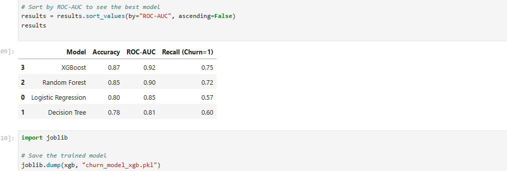

Telco Customer Churn Prediction using Machine Learning
1. Project Objective

The objective of this project is to predict customer churn in a telecom company using Machine Learning techniques.
Customer churn refers to customers who discontinue their service, and predicting churn helps businesses take proactive retention actions.

This project builds an end-to-end ML pipeline:

Data cleaning and exploration
Feature engineering
Model comparison
Final model selection
Ready for deployment using Streamlit
----------------------------------------------------------------------------------------------------------------------------------------------------------------------------------------------------------------
2. Dataset Description
Dataset: Telco Customer Churn Dataset
Source: Kaggle

Target Variable: Churn Value

1 → Customer churned
0 → Customer retained

The dataset contains customer information such as:

Demographics
Subscription details
Contract type
Charges and tenure
Some columns are irrelevant for prediction and require removal.
-------------------------------------------------------------------------------------------------------------------------------------------------------------------------------------------------------------
3. Exploratory Data Analysis (Jupyter Work)

EDA was performed in Jupyter Notebook to understand the data and customer behavior.

Key EDA steps:

Loaded dataset using Pandas
Checked dataset shape and data types
Removed non-informative identifier and location columns
Analyzed churn distribution
Visualized customer behavior patterns

Key insights:

Majority of customers did not churn, indicating class imbalance
Customers with shorter tenure churn more
Month-to-month contracts show significantly higher churn
Customers with higher monthly charges are more likely to churn
EDA helped guide feature selection and model choice.
----------------------------------------------------------------------------------------------------------------------------------------------------------------------------------------------------------------
4. Data Preprocessing

Several preprocessing steps were applied to make the data model-ready:

Dropped irrelevant columns such as:

Customer ID
Location details
Churn reason and scores
Converted Total Charges to numeric format
Handled missing values using median imputation
Applied one-hot encoding to categorical variables
Split data into training and testing sets (80/20 split)
Used stratified sampling to preserve churn ratio.
-----------------------------------------------------------------------------------------------------------------------------------------------------------------------------------------------------------------
5. Machine Learning Models Used

Multiple models were trained and evaluated to identify the best performer.

Model 1: Logistic Regression (Baseline Model)

Used as a baseline classifier
Features were scaled using StandardScaler
Provides interpretability and probabilistic outputs
Purpose: Establish a simple benchmark for churn prediction.
------------------------------------------------------------------------------------------------------------------------------------------------------------------------------------------------------------------
Model 2: Decision Tree Classifier

Captures non-linear relationships
Easy to interpret
Can overfit if not controlled

Purpose: Understand decision-based churn patterns.
---------------------------------------------------------------------------------------------------------------------------------------------------------------------------------------------------------------
Model 3: Random Forest Classifier

Ensemble of decision trees
Handles feature interactions well
class_weight='balanced' used to address churn imbalance

Purpose: Improve performance and generalization.
---------------------------------------------------------------------------------------------------------------------------------------------------------------------------------------------------------------
Model 4: XGBoost (Final Model)

Gradient boosting algorithm
Handles non-linearity and class imbalance effectively

Tuned using:
Learning rate
Tree depth
Subsampling

Why XGBoost was selected:

Highest ROC-AUC score
Best recall for churned customers
Better balance between precision and recall
------------------------------------------------------------------------------------------------------------------------------------------------------------------------------------------------------------------
6. Model Evaluation Metrics

Models were evaluated using multiple metrics:
Accuracy – Overall correctness
ROC-AUC – Ability to distinguish churn vs non-churn
Recall (Churn = 1) – Ability to identify churned customers
Classification Report – Precision, recall, F1-score
Confusion Matrix – Visual performance analysis

XGBoost achieved the best overall performance, especially in identifying churn customers.

<h2>📊 Model Performance Comparison</h2>

The following visualization compares different Machine Learning models using Accuracy and ROC-AUC metrics.

  

-------------------------------------------------------------------------------------------------------------------------------------------------------------------------------------------------------------------
7. Streamlit Application Flow

The trained model can be deployed using Streamlit to create an interactive web app.

Application flow:

User inputs customer details
Inputs are preprocessed
Trained model is loaded
Churn probability is predicted
Result is displayed in real time
This allows business users to predict churn without ML knowledge.
-------------------------------------------------------------------------------------------------------------------------------------------------------------------------------------------------------------------
Final Note:

This project follows an industry-standard ML workflow, separating analysis, modeling,
and deployment, making it scalable and production-ready.
===================================================================================================================================================================================================================
👨‍💻 Author

Shaik Abdul Shahansha
MCA Graduate
Machine Learning & Data Science Enthusiast
===================================================================================================================================================================================================================
if you want to use my code try manually and import and do all process Thankyou!

